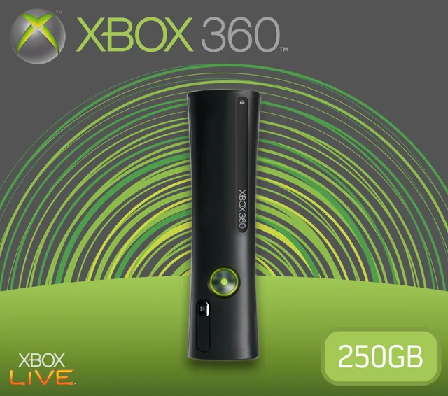
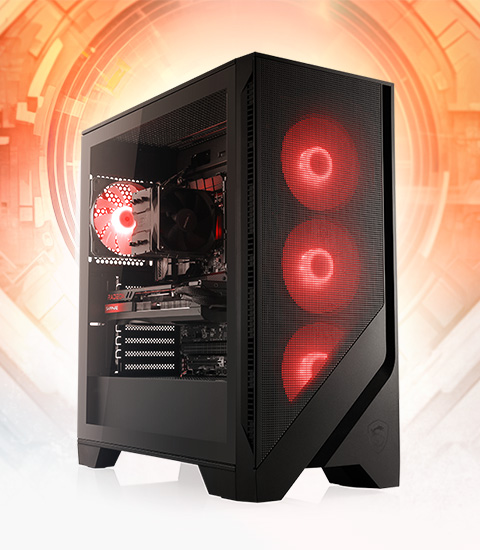
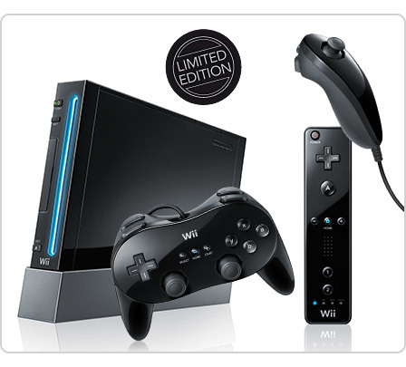
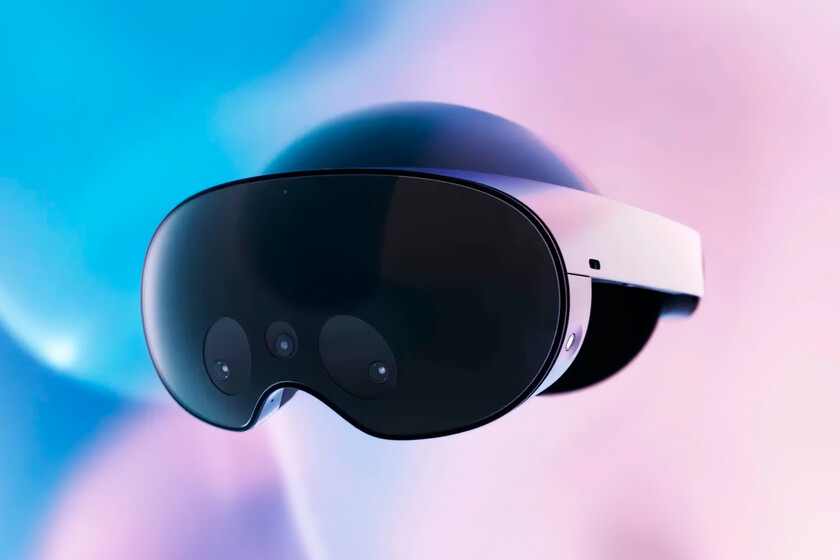
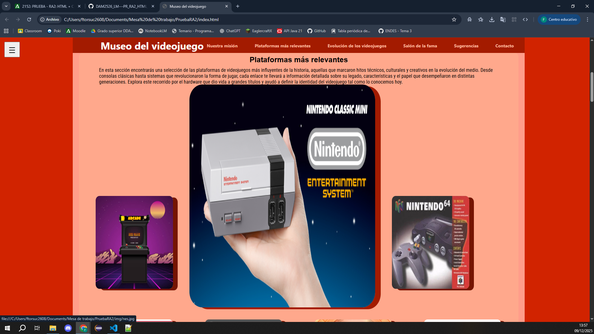
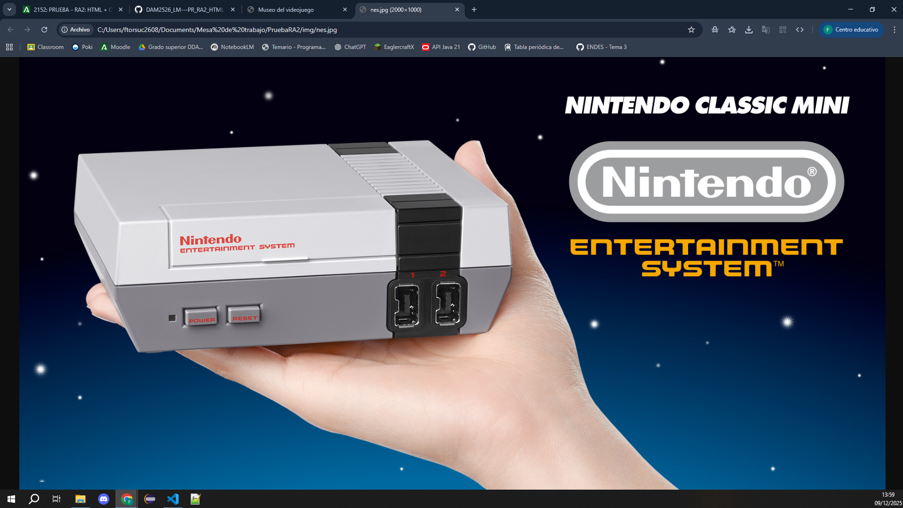

# 🧠 Examen RA2  -  Preguntas del examen 

## Ejercicio 1  
### 1A. Pregunta
¿Por qué NO se centra el texto del `<h1>` en este caso? Explícalo con tus palabras. (por qué visual y estructuralmente no aparece centrado entre el borde izquierdo y el menú)  
  
Porque `text-align` centra el texto dentro del elemento, no centra la posición del elemneto en sí, para eso se deben utilizar Flexbox o Grid.
  
### 1D. Ejercicio – Dar relieve y separación visual al header
Se pretende que la cabecera del sitio (.site-header) tenga un aspecto más definido y se diferencie claramente del resto de la página.  
Debes conseguir, únicamente con CSS, que:  
  
* La cabecera tenga un color de fondo distinto al del resto de la página  
```css
  .site-header {
    display: flex;
    align-items: center;
    background-color:yellowgreen; 
}
```
* Haya una separación visual clara con el contenido que va debajo (por ejemplo, usando un borde inferior y una sombra)  
```css
    .site-header {
    display: flex;
    align-items: center;
    background-color:yellowgreen;
    border:2px solid black;
    box-shadow: 5px 5px black;
}
```
* El contenido del header tenga un espaciado interior adecuado para que no quede “pegado” a los bordes.
```css
    .site-header {
    display: flex;
    align-items: center;
    background-color:yellowgreen;
    border:2px solid black;
    box-shadow: 5px 5px black;
    padding:10px;
}
```
## Ejercicio 2 — Reorganización del header con tres elementos  
### 2A. Ejercicio
Cambia tu HTML para introducir el botón dentro de header
```html
    <header class="site-header">
            <button>btn</button>
            <h1>Mi Sitio Web</h1>

            <nav class="main-nav">
                ...
            </nav>
    </header>
```

## Ejercicio 3 — Miniaturas, zoom y enlace a la imagen original  
  En tu galería de imágenes, debes realizar lo siguiente:  
### 3A. Crear miniaturas  
  Genera nuevas imágenes pequeñas (por ejemplo 200px de ancho aprox.). Debes reemplazar las imágenes de la galería por estas miniaturas.  
```css
  figure a img{  
  width:250px;  
  height:300px;  
  display:table-row;  
  border-radius: 5%;  
  box-shadow: 15px 5px #470C00;  
}  
```
  Se han creado versiones más pequeñas de las imágenes con unas dimensiones de 250x300px.  

### 3B. Efecto hover  
Al pasar el ratón por encima:
* Debe haber zoom suave (por ejemplo usando transform: scale(1.1);)
* Debe aparecer un marco, sombra o borde (elige tú el estilo)
```css
  a img:hover{  
  width:500px;  
  height:600px;  
  transform: scale(1.2);  
  border-radius: 7%;  
  box-shadow: 15px 5px #A31B00;  
}  
```
  Se puede ver en el código el zoom suave y el cambio en la sombra de la imagen.  

### 3C. Enlace a la imagen original
Al hacer clic en la miniatura, la imagen original (de mayor tamaño) debe abrirse en otra pestaña.  
Tu tarea consiste en:
* Escribir el HTML corregido
```html
        <div id="frame">
          <figure>
            <a href="img/arcade.jpg" target="_blank"></a>
          </figure>
          <figure>
            <a href="img/nes.jpg" target="_blank"></a>
          </figure>
          <figure>
            <a href="img/n64.jpg" target="_blank"></a>
          </figure>
          <figure>
            <a href="img/ps1.jpg" target="_blank"></a>
          </figure>
          <figure>
            <a href="img/xbox.jpg" target="_blank"></a>
          </figure>
          <figure>
            <a href="img/pc.jpg" target="_blank"></a>
          </figure>
          <figure>
            <a href="img/wii.jpg" target="_blank"></a>
          </figure>
          <figure>
            <a href="img/metaquest.jpg" target="_blank"></a>
          </figure>
       </div>
```
Las imágenes se abrirán en una pestaña nueva debido a la propiedad  `target="_blank"`
* Escribir el CSS que genera el zoom + marco 
```css
a img:hover{  
  width:500px;  
  height:600px;  
  transform: scale(1.2);  
  border-radius: 7%;  
  box-shadow: 15px 5px #A31B00;  
}  
```
* Incluir una captura en tu informe de evidencias mostrando el resultado  
  
Podemos ver que el efecto del hover funciona correctamente:  
  

Y la imagen se muestra en una pestaña nueva como podemos ver en la imagen:  


## Ejercicio 4 — Informe de evidencias del proyecto (defensa técnica simple)
### Introducción
Explica en 4–6 líneas:  
* El tema de tu web  
* Qué contenido has incluido  
* Cuál era tu idea de diseño  
  
  Mi intención era crear una web para conservar los videojuegos más relevantes a nivel histórico con el fin de que puedan seguirse disfrutando y estudiando. He incluido varias secciones, en las que se habla de la historia de los videojuegos y las consolas que les dan soporte.

### Evidencias de HTML5
Incluye capturas y explicaciones breves del uso de:

header, main, section, footer
el menú superior
el menú lateral ☰
la sección Hero
la tabla
el formulario
la galería de imágenes
enlaces internos y externos

### Evidencias de CSS
Incluye ejemplos de código mostrando:

selectores utilizados (tipo, clase, id, descendente…).
pseudoclases.
Flexbox o Grid en alguna parte.
uso de sombras (box-shadow) o cards.
estilos de tus menús.
Explica qué has intentado conseguir con ese diseño.

### Fuentes utilizadas
Debes explicar:

qué fuente local has incluido (@font-face)
qué fuente online has añadido (Google Fonts)
por qué te han gustado esas tipografías
Incluye fragmentos de código. 

### Menú lateral: breve explicación
No tienes que explicar JavaScript en detalle. Solo:

qué ocurre al pulsar el botón,
qué clase cambia,
cómo se mueve el menú con CSS. 

### Conclusión personal
Explica:

qué has aprendido,
qué te gustaría mejorar,
qué ha sido lo que más te ha costado,
qué parte de tu web te gusta más.


